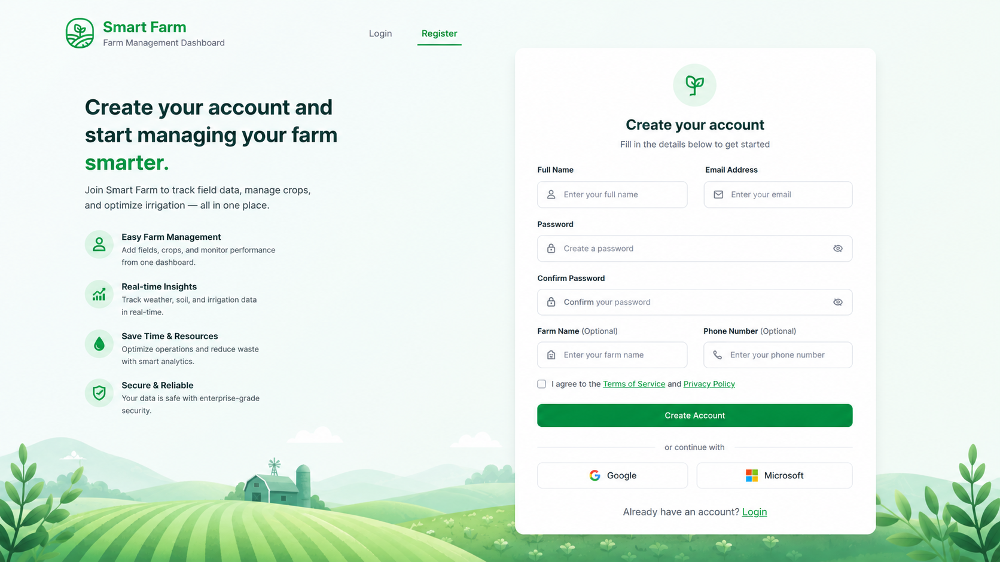
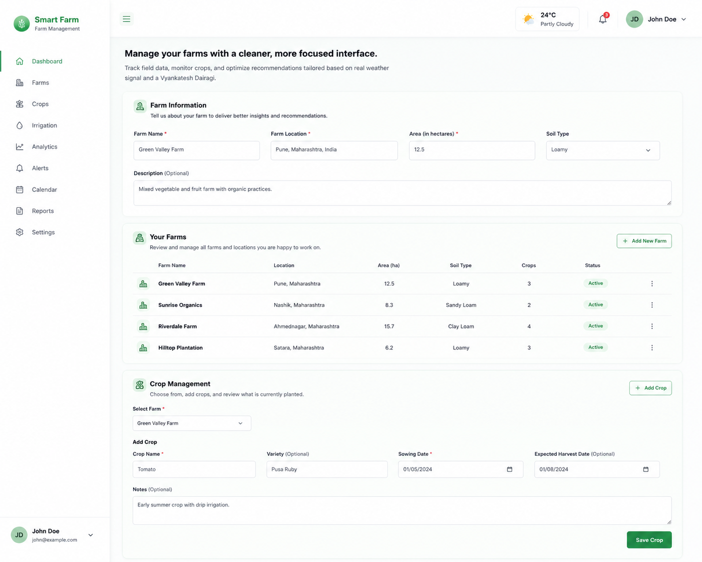

# Smart Farm - Full Stack Farm Management Platform

Smart Farm is a full stack web application for farm management with authentication, farm and crop tracking, irrigation recommendation, and dashboard analytics.

- Backend: Node.js, Express, MongoDB (Mongoose), JWT auth
- Frontend: React + Vite, Axios, React Router, Recharts

## Project Structure

```text
Smart Farm/
  farm-backend/
    config/
    controllers/
    middleware/
    models/
    routes/
    index.js
    package.json
    .env.example
  farm-frontend/
    src/
      components/
      pages/
      services/
      App.jsx
      main.jsx
    package.json
    .env.example
  README.md
```

## Features

### Backend
- User authentication
  - Register with hashed password (bcrypt)
  - Login with JWT token
- JWT-protected APIs for farm and crop management
- Farm CRUD (per-user ownership)
- Crop CRUD (linked to farms)
- Irrigation recommendation API (rule based)
- Input validation middleware
- Centralized error handling middleware
- Production-ready CORS configuration using environment variables

### Frontend
- Login and Register pages with validation
- Dashboard with:
  - Farm list, create, delete
  - Crop management by selected farm
  - Irrigation recommendation form and results
  - Recharts analytics:
    - Bar chart for number of farms
    - Line chart with mock expense data

## Prerequisites

- Node.js 18+
- npm 9+
- MongoDB Atlas cluster or MongoDB URI

## Environment Variables

### Backend (`farm-backend/.env`)
Copy from `.env.example` and fill values:

```env
NODE_ENV=production
PORT=5000
MONGO_URI=mongodb+srv://<user>:<password>@<cluster>/<db>?retryWrites=true&w=majority
JWT_SECRET=replace-with-a-strong-secret
BCRYPT_SALT_ROUNDS=12
CORS_ORIGIN=https://your-frontend.example.com
```

Notes:
- `JWT_SECRET` is required for token sign/verify.
- In production, `CORS_ORIGIN` should contain allowed frontend origins.
- For multiple origins use comma-separated values.

### Frontend (`farm-frontend/.env`)
Copy from `.env.example` and fill value:

```env
VITE_API_URL=https://your-backend.example.com/api
```

For local development:

```env
VITE_API_URL=http://localhost:5000/api
```

## Installation

### 1) Install backend dependencies

```bash
cd "farm-backend"
npm install
```

### 2) Install frontend dependencies

```bash
cd "../farm-frontend"
npm install
```

## Run Locally

### Backend

```bash
cd "farm-backend"
npm run dev
```

Backend runs on `http://localhost:5000` by default.

If MongoDB Atlas is used for development, make sure your current IP is added to the cluster Network Access list. A `MongooseServerSelectionError` during startup usually means the Atlas cluster is blocking the connection rather than the app code failing.

### Frontend

```bash
cd "farm-frontend"
npm run dev
```

Frontend runs on Vite local URL (typically `http://localhost:5173`).

## Production Build and Start

### Backend

```bash
cd "farm-backend"
npm start
```

### Frontend

```bash
cd "farm-frontend"
npm run build
npm start
```

Frontend preview starts on `0.0.0.0:4173`.

## API Documentation

Base URL:

```text
http://localhost:5000/api
```

### Health
- `GET /health`

Response:

```text
Server running
```

### Auth
- `POST /auth/register`
- `POST /auth/login`

Register body:

```json
{
  "name": "John Doe",
  "email": "john@example.com",
  "password": "password123"
}
```

Login body:

```json
{
  "email": "john@example.com",
  "password": "password123"
}
```

Auth response includes token:

```json
{
  "token": "<jwt-token>",
  "user": {
    "id": "...",
    "name": "John Doe",
    "email": "john@example.com"
  }
}
```

## Screenshots

Add the UI screenshots to the repository at `farm-frontend/docs/screenshots/` and include them here.

1. Login screen


2. Register screen



3. Dashboard overview



Replace the placeholder files above with the actual PNGs (or update the paths) to render the images in this README.

### Auth Header for Protected Routes

```text
Authorization: Bearer <jwt-token>
```

### Farms (Protected)
- `POST /farms`
- `GET /farms`
- `GET /farms/:id`
- `PUT /farms/:id`
- `DELETE /farms/:id`

Create farm body:

```json
{
  "name": "North Farm",
  "location": "Nashik",
  "soilType": "Sandy",
  "size": 12.5
}
```

### Crops (Protected)
- `POST /crops`
- `GET /crops/:farmId`
- `PUT /crops/:id`
- `DELETE /crops/:id`

Create crop body:

```json
{
  "farmId": "<farm-id>",
  "cropName": "Wheat",
  "season": "Rabi",
  "sowingDate": "2026-01-15",
  "status": "Sown"
}
```

### Irrigation Recommendation
- `POST /irrigation/recommend`

Body:

```json
{
  "soilType": "sandy",
  "temperature": 34,
  "humidity": 30,
  "rainProbability": 20
}
```

Sample response:

```json
{
  "recommendation": "frequent_watering",
  "reason": "Sandy soil with high temperature or low humidity",
  "suggestion": "Irrigate frequently (daily or every 24 hours)"
}
```

## Frontend Routing

- `/login`
- `/register`
- `/dashboard`

## Security Notes

- Passwords are hashed with bcrypt.
- JWT token is required for protected APIs.
- Input validation middleware checks payload and IDs.
- Global error middleware standardizes server error responses.
- CORS is env-driven for production origin control.

## Quick API Test (cURL)

### Register

```bash
curl -X POST http://localhost:5000/api/auth/register \
  -H "Content-Type: application/json" \
  -d '{"name":"John","email":"john@example.com","password":"password123"}'
```

### Login

```bash
curl -X POST http://localhost:5000/api/auth/login \
  -H "Content-Type: application/json" \
  -d '{"email":"john@example.com","password":"password123"}'
```

### Get Farms (Protected)

```bash
curl http://localhost:5000/api/farms \
  -H "Authorization: Bearer <jwt-token>"
```

## Troubleshooting

### Backend does not start
- Ensure `MONGO_URI` and `JWT_SECRET` are set.
- Check if port 5000 is available.

### CORS error in production
- Ensure `CORS_ORIGIN` includes your deployed frontend URL.
- For multiple frontends, use comma-separated origins.

### Frontend cannot reach backend
- Verify `VITE_API_URL` in frontend `.env`.
- Confirm backend is running and accessible.

## Future Improvements

- Add refresh token flow
- Add role-based access control
- Add unit/integration tests
- Add CI/CD pipeline and containerization
